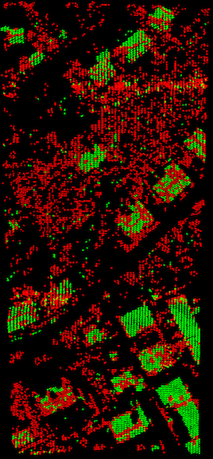
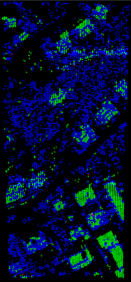

---

### Filtering with PDAL
#### GRiD ConX 2017, 14 November 2017
Bradley J Chambers, Radiant Solutions

---

### Overview

- Getting Started (5 min)
- Filter Stage Roundup (25 min)
- Pipeline Examples (15 min)

---

### Getting Started

+++

### How to pull/start Alpine container

```console
docker pull chambbj/grid-conx
docker run -it --rm chambbj/grid-conx /bin/sh
```

+++

pdal info /data/isprs/samp11-utm.laz

+++

pdal translate /data/isprs/samp11-utm.laz /data/isprs/samp11-utm.bpf

+++

```json
{
  "pipeline":[
    "input.las",
    {
      "type":"filters.whatever",
      "some":"options"
    },
    "output.laz"
  ]
}
```
@[3](Inferred reader)
@[4-7](Filter with options)
@[8](Inferred writer)

+++

```bash
pdal pipeline pipeline.json
```

+++

```bash
pdal pipeline pipeline.json --readers.las.filename=input.las --writers.las.filename=output.las
```
@[1](Override options from the CLI)

+++

```json
{
  "pipeline":[
    {
      "type":"filters.whatever",
      "some":"options"
    }
  ]
}
```

+++

```bash
pdal translate input.las output.las --json pipeline.json
```

---

### Filter Stage Roundup

+++

But first...

+++

### DimRange

* A [DimRange](https://www.pdal.io/stages/filters.range.html#ranges) is a
  * named dimension, and
  * range of values.
* Bounds can be inclusive (`[]`) or exclusive (`()`).
* Ranges can be negated (`!`).

+++

```json
{
  "pipeline":[{
    "type":"filters.assign",
    "assignment":"Classification[:]=0"
  }, {
    "type":"filters.assign",
    "assignment":"Classification[2:4]=0"
  }]
}
```
@[3-4](Reassign all classification values to 0)
@[6-7](Reassign ground (2), low (3) and medium (4) vegetation values to created, never classified (0))

+++

```json
{
  "pipeline":[{
    "type":"filters.range",
    "limits":"Z[10:)"
  }, {
    "type":"filters.range",
    "limits":"Classification[2:2]"
  }]
}
```
@[3-4](Select all points with Z greater than or equal to 10)
@[6-7](Select all points with classification of 2)

+++

### Ignoring a `DimRange`

- Available to `filters.pmf` and `filters.smrf`
- Eliminates the need to completely remove points (e.g., noise)
- Instead, points are ignored

+++

```json
{
  "pipeline":[
    {
      "type":"filters.range",
      "limits":"Classification![7:7]"
    },
    {
      "type":"filters.smrf"
    }
  ]
}
```
@[1-11](Noise points are removed!)

+++

```json
{
  "pipeline":[
    {
      "type":"filters.smrf",
      "ignore":"Classification[7:7]"
    }
  ]
}
```
@[1-8](Noise points are left intact, just ignored.)

+++

### Filter "categories"

- create/alter dimensions (other than XYZ)
- change point order
- move points
- cull points
- create points
- create new PointViews
- join PointViews
- create metadata
- create meshes
- embed other languages

+++

### Filters that create/alter dimensions (other than XYZ)

| Filter Name |
|----|
| [ApproximateCoplanar](https://www.pdal.io/stages/filters.approximatecoplanar.html) |
| [Assign](https://www.pdal.io/stages/filters.assign.html) |
| [Cluster](https://www.pdal.io/stages/filters.cluster.html) |
| [ColorInterp](https://www.pdal.io/stages/filters.colorinterp.html) |
| [Colorization](https://www.pdal.io/stages/filters.colorization.html) |
| [ComputeRange](https://www.pdal.io/stages/filters.computerange.html) |
| [Eigenvalues](https://www.pdal.io/stages/filters.eigenvalues.html) |
| [EstimateRank](https://www.pdal.io/stages/filters.estimaterank.html) |
| [Extended Local Minimum](https://www.pdal.io/stages/filters.elm.html) |
| [Ferry](https://www.pdal.io/stages/filters.ferry.html) |

+++

### Filters that create/alter dimensions (other than XYZ)

- [HAG](https://www.pdal.io/stages/filters.hag.html)
- [KDistance](https://www.pdal.io/stages/filters.kdistance.html)
- [LOF](https://www.pdal.io/stages/filters.lof.html)
- [Mongus](https://www.pdal.io/stages/filters.mongus.html)
- [Normal](https://www.pdal.io/stages/filters.normal.html)
- [Outlier](https://www.pdal.io/stages/filters.outlier.html)
- [Overlay](https://www.pdal.io/stages/filters.overlay.html)
- [PMF](https://www.pdal.io/stages/filters.pmf.html)
- [RadialDensity](https://www.pdal.io/stages/filters.radialdensity.html)
- [SMRF](https://www.pdal.io/stages/filters.smrf.html)

+++

### Filters that change point order

- [MortonOrder](https://www.pdal.io/stages/filters.mortonorder.html)
- [Randomize](https://www.pdal.io/stages/filters.randomize.html)
- [Sort](https://www.pdal.io/stages/filters.sort.html)

+++

### Filters that move points

- [Reprojection](https://www.pdal.io/stages/filters.reprojection.html)
- [Transformation](https://www.pdal.io/stages/filters.transformation.html)

+++

### Filters that cull points

- [Crop](https://www.pdal.io/stages/filters.crop.html)
- [Decimation](https://www.pdal.io/stages/filters.decimation.html)
- [Divider](https://www.pdal.io/stages/filters.divider.html)
- [Head](https://www.pdal.io/stages/filters.head.html)
- [IQR](https://www.pdal.io/stages/filters.iqr.html)
- [Locate](https://www.pdal.io/stages/filters.locate.html)
- [MAD](https://www.pdal.io/stages/filters.mad.html)
- [Range](https://www.pdal.io/stages/filters.range.html)
- [Sample](https://www.pdal.io/stages/filters.sample.html)
- [Tail](https://www.pdal.io/stages/filters.tail.html)
- [VoxelCenterNearestNeighbor](https://www.pdal.io/stages/filters.voxelcenternearestneighbor.html)
- [VoxelCentroidNearestNeighbor](https://www.pdal.io/stages/filters.vVoxelCentroidNearestNeighbor.html)

+++

### Filters that create points

- [PCLBlock](https://www.pdal.io/stages/filters.pclblock.html)
- [VoxelGrid](https://www.pdal.io/stages/filters.voxelgrid.html)

+++

### Filters that create new PointViews

- [Chipper](https://www.pdal.io/stages/filters.chipper.html)
- [Divider](https://www.pdal.io/stages/filters.divider.html)
- [Groupby](https://www.pdal.io/stages/filters.groupby.html)
- [Splitter](https://www.pdal.io/stages/filters.splitter.html)

+++

### Filters that join PointViews

- [Merge](https://www.pdal.io/stages/filters.merge.html)

+++

### Filters that create metadata

- [CPD](https://www.pdal.io/stages/filters.cpd.html)
- [HexBin](https://www.pdal.io/stages/filters.hexbin.html)
- [ICP](https://www.pdal.io/stages/filters.icp.html)
- [Stats](https://www.pdal.io/stages/filters.stats.html)

+++

### Filters that create meshes

- [GreedyProjection](https://www.pdal.io/stages/filters.greedyprojection.html)
- [GridProjection](https://www.pdal.io/stages/filters.gridprojection.html)
- [MovingLeastSquares](https://www.pdal.io/stages/filters.movingleastsquares.html)
- [Poisson](https://www.pdal.io/stages/filters.poisson.html)

+++

### Filters to embed other languages

- [Matlab](https://www.pdal.io/stages/filters.matlab.html)
- [Python](https://www.pdal.io/stages/filters.python.html)

---

### Example Pipelines

Credit to Chris Irwin.

+++

```json
{
  "pipeline":[{
    "type":"readers.las",
    "spatialreference":"EPSG:32610"
  }, {
    "type":"filters.assign",
    "assignment":"Classification[2:4]=0"
  }, {
    "type":"filters.smrf",
    "ignore":"Classification[7:7]"
  }, {
    "type":"writers.las",
    "compression":"true",
    "scale_x":"0.001",
    "scale_y":"0.001",
    "scale_z":"0.001",
    "offset_x":"auto",
    "offset_y":"auto",
    "offset_z":"auto"
  }]
}
```
@[3-4](Read the data, assigning a spatial reference)
@[6-7](Reset ground(2), low(3) and medium(4) vegetation to created, never classified (0))
@[9-10](Apply Simple Morphological Filter, ignoring noise (7))
@[12-19](Write compressed LAZ with mm precision and auto offsets)

+++

```json
{
  "pipeline":[{
    "type":"readers.las"
  }, {
    "type":"filters.range",
    "limits":"Classification[2:2]"
  }, {
    "type":"filters.poisson",
    "depth":"8"
  }, {
    "type":"writers.ply",
    "faces":"true",
    "storage_mode":"little endian"
  }]
}
```
@[3](Read the data)
@[5-6](Passthrough only ground returns (2))
@[8-9](Perform Poisson surface reconstruction)
@[11-13](Write PLY)

+++

```json
{
  "pipeline":[{
    "type":"readers.las",
    "spatialreference":"EPSG:32610"
  }, {
    "type":"filters.range",
    "limits":"Classification[2:4]"
  }, {
    "type":"filters.greedyprojection"
  }, {
    "type":"writers.ply",
    "faces":"true"
  }]
}
```
@[3-4](Read the data, assigning a spatial reference)
@[6-7](Passthrough only ground (2), low (3) and medium (4) vegetation)
@[9](Perform greedy projection surface reconstruction)
@[11-12](Write PLY)

+++

```json
{
  "pipeline":[{
    "type":"readers.las"
  }, {
    "type":"filters.reprojection",
    "in_srs":"EPSG:6340",
    "out_srs":"EPSG:26911"
  }, {
    "type":"filters.assign",
    "assignment":"Classification[:]=0"
  }, {
    "type":"filters.outlier"
  }, {
    "type":"filters.range",
    "limits":"Classification![7:7]"
  }, {
    "type":"filters.smrf"
  }, {
    "type":"filters.splitter",
    "length":"1000"
  }, {
    "type":"writers.las",
    "scale_x":"0.001",
    "scale_y":"0.001",
    "scale_z":"0.001",
    "offset_x":"auto",
    "offset_y":"auto",
    "offset_z":"auto"
  }, {
    "type":"filters.merge"
  }, {
    "type":"filters.range",
    "limits":"Classification[2:2]"
  }, {
    "type":"writers.gdal",
    "radius":0.7071,
    "resolution":0.5,
    "output_type":"idw",
    "nodata":-9999,
    "window_size":2,
    "gdalopts":"COMPRESS=DEFLATE,TILED=YES,PREDICTOR=3"
  }]
}
```
@[3](Read the data)
@[5-7](Reproject the data)
@[9-10](Reset all classifications to created, never classified (0))
@[12](Mark outliers (7))
@[14-15](Passthrough all points not marked as noise (7))
@[17](Apply Simple Morphological Filter)
@[19-20](Split the point cloud into 1km tiles)
@[22-28](Write uncompressed LAS with mm precision and auto offsets)
@[30](Merge all tiles)
@[32-33](Passthrough only ground returns (2))
@[35-41](Write 0.5m DEM using IDW)

+++

```json
{
  "pipeline": [
    "./data/isprs/samp11-utm.laz",
    {
      "type": "filters.smrf"
    }, {
      "type": "filters.hag"
    }, {
      "type": "filters.range",
      "limits": "HeightAboveGround[3:]"
    }, {
      "type": "filters.cluster",
      "tolerance": 3
    }, {
      "type": "filters.groupby",
      "dimension": "ClusterID"
    }, {
      "type": "filters.locate",
      "dimension": "HeightAboveGround",
      "minmax": "max"
    }, {
      "type": "filters.merge"
    }, {
      "type": "filters.range",
      "limits": "HeightAboveGround[20:]"
    }
  ]
}
```
@[3](Read the data)
@[5](Apply Simple Morphological Filter)
@[7](Compute Height Above Ground)
@[9-10](Passthrough only points with HeightAboveGround greater than 3 meters)
@[12-13](Perform Euclidean cluster extraction with tolerance of 3 meters)
@[15-16](Create separate PointView for each cluster)
@[18-20](Locate the maximum HeightAboveGround value in each cluster)
@[22](Merge maximum HeightAboveGround results from each cluster)
@[24-25](Retain only those clusters with maximum HeightAboveGround value over 20 meters)

+++

```python
>>> p = pdal.Pipeline(json)
>>> count = p.execute()
>>> vo = pd.DataFrame(p.arrays[0], columns=['X','Y','Z','HeightAboveGround'])
>>> vo.describe()
```

```bash
                   X             Y           Z  HeightAboveGround
count      15.000000  1.500000e+01   15.000000          15.000000
mean   512799.513333  5.403632e+06  352.667333          38.212000
std        23.111817  4.812817e+01   22.661835          16.576486
min    512730.790000  5.403557e+06  317.300000          20.050000
25%    512795.435000  5.403623e+06  333.970000          21.895000
50%    512798.290000  5.403624e+06  354.110000          38.450000
75%    512813.460000  5.403626e+06  367.255000          54.255000
max    512831.280000  5.403739e+06  401.930000          63.700000
```

+++

```python
>>> vo
```

```bash
            X           Y       Z  HeightAboveGround
0   512794.22  5403576.38  317.30              21.99
1   512827.97  5403630.85  329.92              24.45
2   512786.89  5403626.56  366.60              58.15
3   512811.06  5403612.84  326.88              20.26
4   512792.11  5403626.03  368.89              59.78
5   512797.05  5403624.26  338.02              28.91
6   512796.65  5403624.90  350.39              41.28
7   512798.29  5403625.87  361.53              52.31
8   512797.34  5403623.67  347.56              38.45
9   512798.47  5403623.67  354.11              44.89
10  512798.73  5403624.20  365.42              56.20
11  512831.28  5403557.39  323.52              20.96
12  512815.86  5403621.44  370.03              63.70
13  512815.99  5403739.10  367.91              20.05
14  512730.79  5403738.80  401.93              21.80
```

+++

```json
{
  "pipeline":[
    "./data/isprs/samp11-utm.laz",
    {
      "type":"filters.smrf"
    }, {
      "type":"filters.hag"
    }, {
      "type":"filters.range",
      "limits":"HeightAboveGround[2:)"
    }, {
      "type":"filters.approximatecoplanar"
    }]
}
```
@[3](Read the data)
@[5](Apply Simple Morphological Filter)
@[7](Compute Height Above Ground)
@[9-10](Passthrough only points with HeightAboveGround greater than 2 meters)
@[12](Determine if a point is in an approximately coplanar region)

+++



+++

```json
{
  "pipeline":[
    "./data/isprs/samp11-utm.laz",
    {
      "type":"filters.smrf"
    }, {
      "type":"filters.hag"
    }, {
      "type":"filters.range",
      "limits":"HeightAboveGround[2:)"
    }, {
      "type":"filters.estimaterank"
    }
  ]
}
```
@[3](Read the data)
@[5](Apply Simple Morphological Filter)
@[7](Compute Height Above Ground)
@[9-10](Passthrough only points with HeightAboveGround greater than 2 meters)
@[12](Estimate rank at each point)

+++



+++

```json
{
  "pipeline":[{
    "type":"readers.las"
  }, {
    "type":"filters.smrf"
  }, {
    "type":"filters.hag"
  }, {
    "type":"filters.colorinterp",
    "dimension":"HeightAboveGround",
    "minimum":0.0,
    "maximum":20.0,
    "ramp":"blue_orange"
  }, {
    "type":"writers.prc",
    "prc_filename":"/Users/chambbj/Temp/colorinterp-prc.prc",
    "pdf_filename":"/Users/chambbj/Temp/colorinterp-prc.pdf"
  }]
}
```
@[3](Read the data)
@[5](Apply Simple Morphological Filter)
@[7](Compute Height Above Ground)
@[9-13](Colorize points by Height Above Ground)
@[15-17](Write PDF)

---

## Questions?
